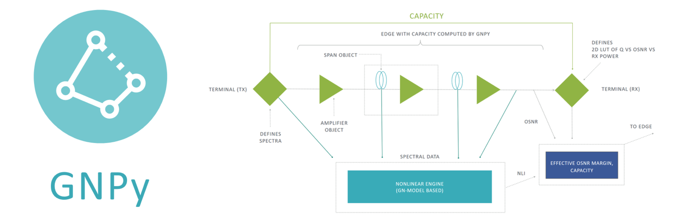
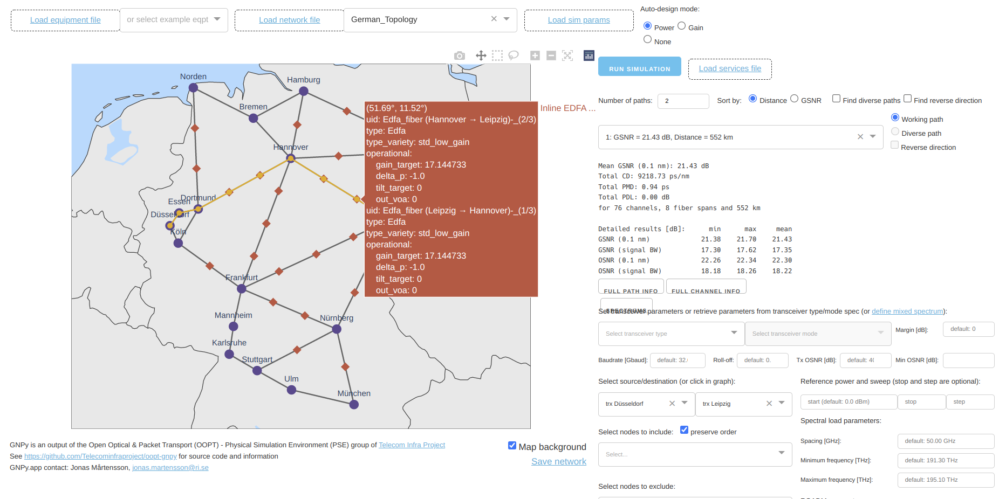

# GNPy: Optical Route Planning and DWDM Network Optimization

[](https://pypi.org/project/gnpy/)
[](https://pypi.org/project/gnpy/)
[](http://gnpy.readthedocs.io/en/master/?badge=master)
[](https://github.com/Telecominfraproject/oopt-gnpy/actions/workflows/main.yml)
[](https://review.gerrithub.io/q/project:Telecominfraproject/oopt-gnpy+is:open)
[](https://github.com/Telecominfraproject/oopt-gnpy/graphs/contributors)
[](https://codecov.io/gh/Telecominfraproject/oopt-gnpy)
[](https://doi.org/10.5281/zenodo.3458319)
[](https://matrix.to/#/%23oopt-gnpy%3Afoss.wtf?via=matrix.org&via=foss.wtf)

GNPy is an open-source, community-developed library for building route planning and optimization tools in real-world mesh optical networks.
We are a consortium of operators, vendors, and academic researchers sponsored via the [Telecom Infra Project](http://telecominfraproject.com)'s [OOPT/PSE](https://telecominfraproject.com/open-optical-packet-transport) working group.
Together, we are building this tool for rapid development of production-grade route planning tools which is easily extensible to include custom network elements and performant to the scale of real-world mesh optical networks.



## Quick Start

Install either via [Docker](https://gnpy.readthedocs.io/en/master/install.html#using-prebuilt-docker-images), or as a [Python package](https://gnpy.readthedocs.io/en/master/install.html#using-python-on-your-computer).
Read our [documentation](https://gnpy.readthedocs.io/), learn from the demos, and [get in touch with us](https://github.com/Telecominfraproject/oopt-gnpy/discussions).

This example demonstrates how GNPy can be used to check the expected SNR at the end of the line by varying the channel input power:


GNPy can do much more, including acting as a Path Computation Engine, tracking bandwidth requests, or advising the SDN controller about a best possible path through a large DWDM network.
Learn more about this [in the documentation](https://gnpy.readthedocs.io/), or give it a [try online at `gnpy.app`](https://gnpy.app/):

[](https://gnpy.app/)

## Running a simulation for a specific channel

python parsetables.py <channel_frequency>

For example: python parsetables.py 193.5

You can also run the simulation for a specific span using the shell scripts. For example:

```bash
./32-albgain.sh
```

simulates all channels propogatinig between NYC and ALB. Or:

```bash
./alb-syr.sh
```

simulates all channels propogating between ALB and SYR. There are also scripts for the reverse of these paths.

## Running the optimizer for the network (this will run on the 193.5 THz channel by default)

python network_optimizer.py


## Definitions for amplifiers and the network

The network is defined in the JSON files inside gnpy/nysernet/ ending in "gain" and "optimize". The files are separated by section. For example, 32-albgain.json defines the span between NYC and ALB, while alb-syrgain.json defines the span between ALB and SYR. The JSON files contain the gain targets, VOA settings, tilt settings, fiber span length, and ROADMs of the network. The optimized values are files which end in "optimize".

The amplifiers, fiber specs, ROADM specs, and span specs are defined inside gnpy/nysernet/eqpt_config_gain.json. The amplifiers are defined by their model type and we provide the max/min gain, max/min noise figure, max input power and other details. 

The channels propogating through the network are defined in the JSON files inside gnpy/nysernet/ ending in "spectrum". The channel center frequencies are defined in the JSON files, as well as the baud rate, transmit OSNR, and roll off. The spectrum of frequencies are the same in both directions of a span. For example, syr-albspectrum.json defines the channel frequencies propogating from SYR to ALB and also from ALB to SYR, while alb-32spectrum.json defines the channel frequencies propogating from ALB to NYC and also from NYC to ALB.